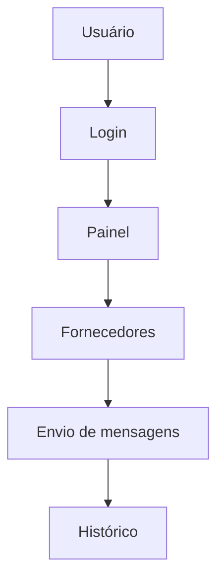

# 📄 Escopo de Desenvolvimento

---

> [!info] Projeto complementar
> Este documento descreve o escopo do desenvolvimento de um novo sistema solicitado para automação de contato com fornecedores.

---

# 🎯 Objetivo

Desenvolver uma aplicação web que permita organizar fornecedores e enviar mensagens automaticamente para múltiplos contatos, facilitando processos de cotação e negociação.

---

# ⚙️ Funcionalidades

## Cadastro de fornecedores

O sistema permitirá:

- adicionar fornecedores
- editar informações
- excluir fornecedores
- visualizar lista completa

Campos:

- Nome
- Empresa
- Telefone / WhatsApp
- Email
- Observações

---

## Importação de contatos

Importação através de:

- CSV
- Excel

O sistema realizará:

- validação de dados
- remoção de duplicados
- padronização de números

---

## Automação de mensagens

Funcionalidades:

- criação de templates
- envio para múltiplos fornecedores
- personalização automática

Exemplo:

```
Olá {nome}, estou buscando fornecedores para {produto}.
Poderia me enviar mais informações?
```

---

## Dashboard

Painel contendo:

- total de fornecedores
- mensagens enviadas
- atividades recentes

---

## Histórico de mensagens

Registro contendo:

- mensagem enviada
- fornecedor
- data e hora
- status

---

# 🔄 Fluxo do Sistema



---

# 🖥 Tecnologias

Backend
- Python
- Flask
- SQLAlchemy

Frontend
- HTML
- CSS
- JavaScript

Banco de dados
- PostgreSQL

Automação
- Redis

---

# ⏱ Prazo

Tempo estimado:

**10 a 15 dias úteis**

---

# 💰 Investimento

Valor do desenvolvimento:

**R$ 1.500**

Pagamento sugerido:

- 50% início
- 50% entrega

---

# 🔧 Suporte

Manutenção opcional:

**R$ 250 / mês**

Inclui:

- suporte técnico
- correções
- pequenas melhorias